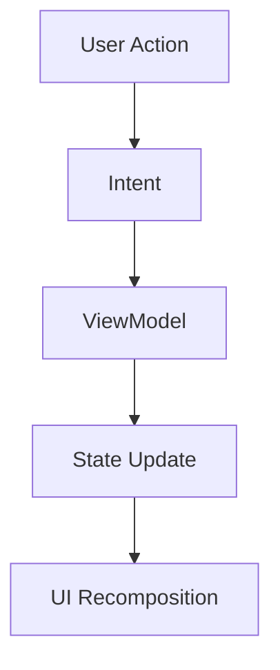

# 🚀 KMP MVI Compose Architecture Sample
Kotlin Multiplatform (Android • iOS • Web)

> This repository is a Kotlin Multiplatform (KMP) sample project demonstrating MVI architecture using Compose Multiplatform, Koin and Ktor.

A production-ready Kotlin Multiplatform (KMP) demo project demonstrating: 
✅ Shared UI  
✅ Shared Business Logic  
✅ MVI Architecture  
✅ Compose Multiplatform  
✅ Clean & Scalable Base Structure  

This project is built as a portfolio-ready architecture template for small, medium, and enterprise applications.

## 📱 Platforms Supported
* Android
* iOS
* Web (Compose Web)

## 📸 Screens
🛍 Product List Screen  
📄 Product Detail Screen  

Data is fetched from APIs and rendered using Compose Multiplatform.

## 🛠 Tech Stack

| Technology | Purpose |
|----------|----------|
| Kotlin Multiplatform | Shared logic & UI |
| Compose Multiplatform | UI rendering |
| MVI Pattern | State management |
| Koin | Dependency Injection |
| Ktor | API integration |
| Coil | Image loading |
| Coroutines & Flow | Reactive programming |

## 🧱 Architecture Overview

This project follows Clean Architecture + MVI pattern.

🔹 Presentation Layer
* BaseViewModel
* BaseScreen
* Intent / State / Event handling
* Preview-friendly composables

🔹 Data Layer
* Repository pattern
* API services (Ktor)

## 🔁 MVI Flow

This ensures:
* Unidirectional data flow
* Predictable state management
* High scalability
* Better testability

## 🎯 Why This Repository?

This project is useful for developers who want:
* Kotlin Multiplatform example project
* KMP with MVI architecture
* Compose Multiplatform sample
* Koin in KMP setup
* Ktor networking in shared module
* Production-ready base architecture

## 🚀 How to Run
### Android
Run androidApp configuration in Android Studio.

### iOS
Open iosApp in Xcode and run on simulator/device.

### Web
Run web configuration from IDE.

## 🧠 Learning Outcomes

By exploring this repository, you will understand:
* How to structure KMP apps properly
* How to implement MVI in shared module
* How to share UI across platforms
* How to create reusable base screen architecture
* How to setup Koin in KMP
* How to integrate Ktor in shared code

---

## If you found this useful:

⭐ Star the repository  
🤝 Connect with me on LinkedIn <a href="https://www.linkedin.com/in/naimish-trivedi/"> Naimish Trivedi </a>  
